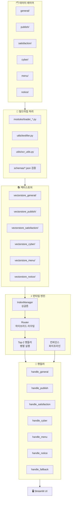
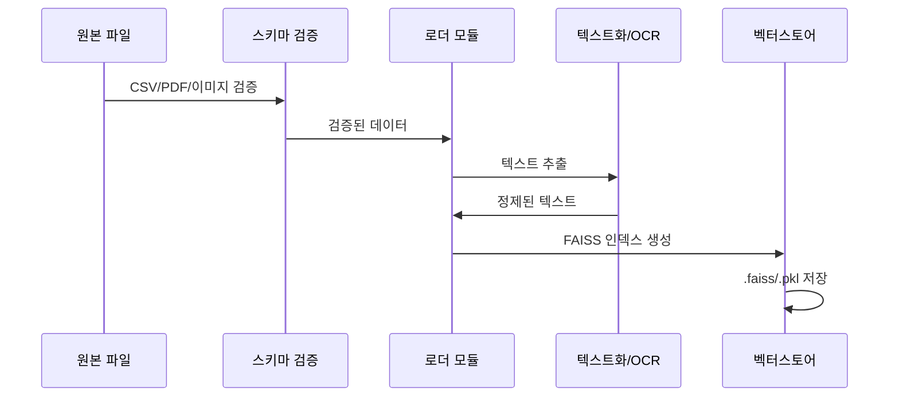
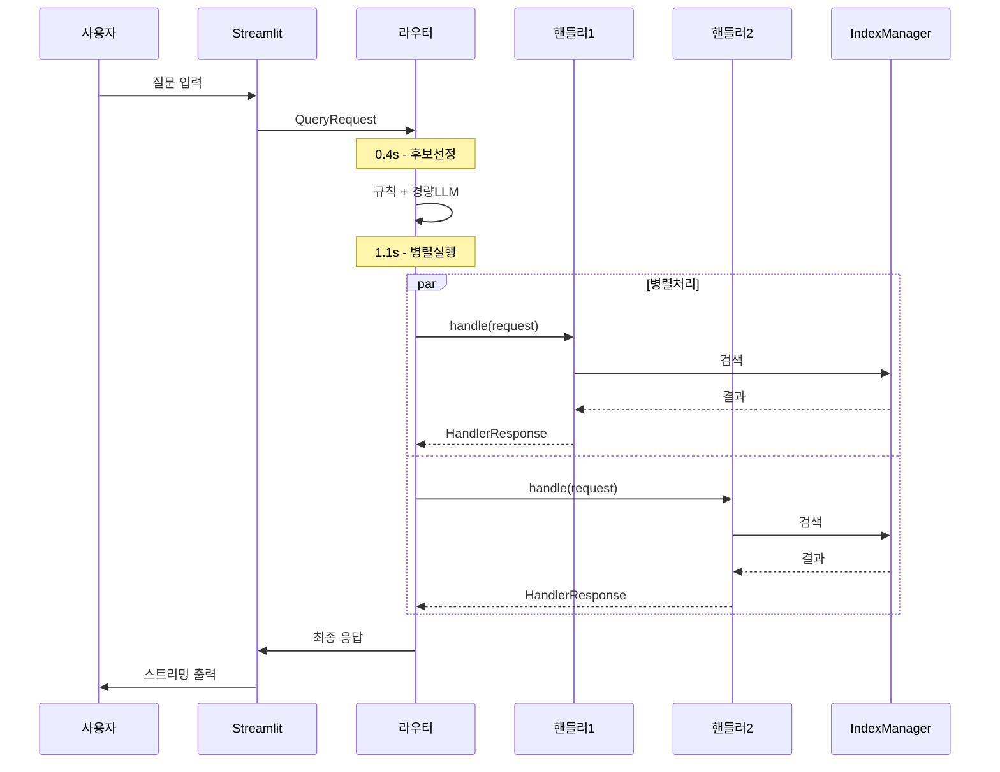

# BYEOLI_TALK_AT_GNHRD_app Architecture

## 개요

경상남도인재개발원용 RAG 기반 챗봇으로, 다양한 내부 문서(교육계획, 만족도 조사, 학칙, 공지사항 등)를 기반으로 질의응답 서비스를 제공합니다.

## 전체 아키텍처



## 핵심 설계 원칙

### 1. IndexManager 싱글톤 & 사전 로드
- **앱 기동 시 모든 FAISS 인덱스를 메모리에 로드**
- **해시 기반 파일 변경 감지로 핫스왑**
- **전역 공유로 핸들러 간 일관성 보장**

### 2. 하이브리드 라우팅 + 병렬 실행
```
총 타임박스: 1.5s
├── 후보선정 (규칙 + 경량LLM): 0.4s
└── Top-2 핸들러 병렬실행: 1.1s
```
- **1차**: 키워드 규칙으로 후보군 필터링
- **2차**: 경량 LLM으로 Top-2 핸들러 선정
- **3차**: 선정된 핸들러 병렬 실행, 점수 우선 반환

### 3. 컨피던스 기반 적응형 파이프라인
핸들러별 임계값(θ):
- general: 0.70
- publish: 0.74  
- satisfaction: 0.68
- cyber: 0.66
- menu: 0.64
- notice: 0.62

**처리 로직**:
```
confidence ≥ θ → 즉시 응답 생성
confidence < θ → k 확장 검색 또는 재질문
```

## 데이터 플로우

### 빌드타임 플로우


### 런타임 질의 플로우


## 대화형 RAG 설계

### ConversationContext 관리
```
세션 영속성: st.session_state (메모리 only)
recent_messages 윈도우: 6턴
요약 갱신 주기: 매 4턴 (1,000토큰 초과 시 보조 갱신)
캐시 키: normalize(query) + hash(summary + entities)
```

### 후속질문 처리
- **follow_up=true** 감지 시 해당 핸들러 θ -0.02 완화
- **지시어/대명사 해소**: QueryExpander로 컨텍스트 기반 확장
- **엔티티 연속성**: 이전 대화의 핵심 엔티티 유지

## Retriever 표준화

### 하이브리드 검색 (FAISS + BM25)
```
1. FAISS 의미론적 검색: k=5 (확장 시 k=12)
2. BM25 키워드 검색: 동일 k값
3. RRF(Reciprocal Rank Fusion) 재랭킹
4. MMR로 문서 다양성 확보
```

### 청킹 전략
- **청크 크기**: 1,000 토큰
- **오버랩**: 100 토큰  
- **문서 경계**: 페이지/섹션 단위 보존

## 캐시 전략

### 3종 캐시 시스템
1. **쿼리 캐시**: 정규화된 쿼리 + 소스해시
2. **Retrieval 캐시**: 검색 결과 중간 저장
3. **임베딩 캐시**: 디스크 기반 임베딩 결과

### TTL 설정
```
notice/menu: 6시간 (자주 변경)
general/publish/satisfaction/cyber: 30일 (안정적)
```

## 성능 최적화

### 응답 시간 목표
- **첫 토큰**: ≤ 1초
- **전체 응답**: 2-4초
- **스트리밍 우선**: 점진적 출력

### 리소스 관리
- **메모리**: IndexManager 싱글톤으로 중복 로드 방지
- **CPU**: 병렬 실행으로 처리량 극대화  
- **I/O**: 캐시 계층으로 디스크 접근 최소화

## 품질 관리

### 응답 계약 (Pydantic)
- **QueryRequest**: 요청 스키마 검증
- **HandlerResponse**: 응답 형식 보장
- **Citation**: 소스 2-3건 필수 인용

### 포스트 룰체크
```python
날짜 형식: YYYY-MM-DD 표준화
숫자 단위: 천 단위 콤마, 단위 표기 통일
계산값: 자동 재검산 및 불일치 시 수정
```

## 실패 처리 전략

### 타임아웃 처리
```
1.5초 타임박스 초과 → 가장 진행률 높은 핸들러 결과 반환
네트워크 오류 → 캐시된 응답 또는 fallback 핸들러
```

### 컨피던스 부족
```
θ 미만 → k값 확장 재검색
재검색 실패 → 사용자 재질문 유도  
완전 실패 → fallback 핸들러 (일반적 안내)
```

### 오류 전파 방지
- **핸들러별 독립 실행**: 하나 실패해도 다른 핸들러 영향 없음
- **Graceful Degradation**: 부분 실패 시 가용한 결과로 응답
- **상세 로깅**: 실패 원인 추적 및 개선점 도출

## 확장성 고려사항

### 수평 확장
- **핸들러 추가**: 새 도메인별 핸들러 손쉽게 추가
- **데이터 소스 확장**: 새 `/data` 폴더 및 로더 추가
- **모델 교체**: 임베딩/LLM 모델 설정 기반 교체

### 성능 튜닝
- **θ 값 자동 조정**: EWMA 기반 ±0.02 범위 튜닝  
- **캐시 최적화**: 히트율 기반 TTL 동적 조정
- **배치 처리**: 대량 인덱싱 시 배치 단위 처리

---

## 파일별 역할 요약

| 컴포넌트 | 역할 | 의존성 |
|---------|------|--------|
| `utils/router.py` | 하이브리드 라우팅, 병렬 실행 관리 | IndexManager, 모든 핸들러 |
| `utils/context_manager.py` | 대화 상태 관리, 세션 영속성 | contracts, config |
| `utils/embedder.py` | FAISS+BM25 하이브리드 검색 | config, 캐시 |
| `IndexManager` | 벡터스토어 로드/핫스왑 | embedder, 파일시스템 |
| `handlers/*` | 도메인별 질의 응답 처리 | embedder, contracts |
| `modules/*` | 빌드타임 인덱스 생성 | textifier, ocr_utils |

이 아키텍처는 **확장성, 성능, 품질**의 균형을 맞춘 설계로, 교육기관의 다양한 질의를 효율적으로 처리할 수 있도록 구성되었습니다.
