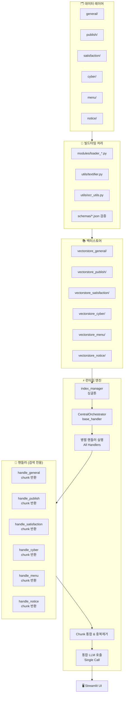
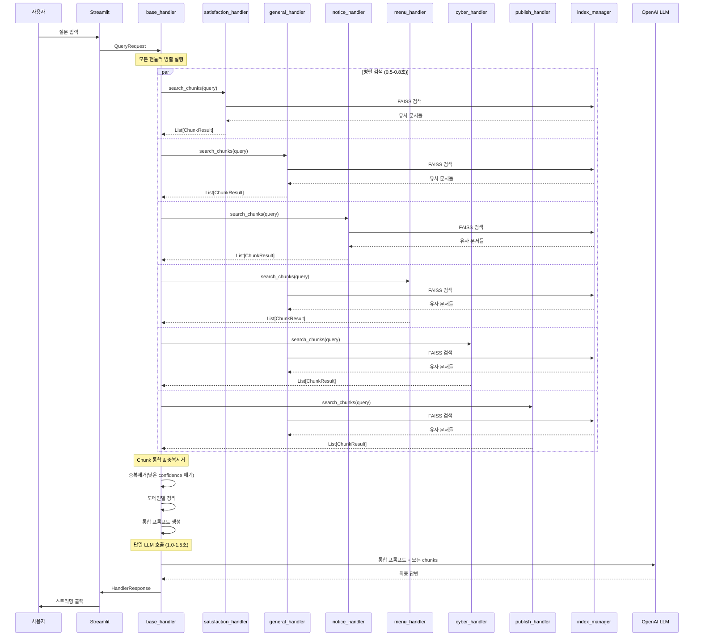

# BYEOLI_TALK_AT_GNHRD_app Architecture v2.0

## 개요

경상남도인재개발원용 RAG 기반 챗봇으로, 챗봇의 이름은 "벼리(Byeoli)"이며, 다양한 내부 문서(교육계획, 만족도 조사, 학칙, 공지사항 등)를 기반으로 질의응답 서비스를 제공합니다.

**핵심 설계 원칙**: 모든 핸들러 병렬 실행 → chunk 수집 → 통합 LLM 호출

## 전체 아키텍처



## 핵심 설계 변경점

### ❌ 기존 방식 (제거됨)
- Router 기반 핸들러 선택
- Top-2 핸들러만 실행
- 각 핸들러가 독립적으로 LLM 호출
- 컨피던스 기반 핸들러 우선순위

### ✅ 새로운 방식
- **모든 핸들러 병렬 실행**: 6개 핸들러 동시 검색
- **Chunk 수집 방식**: 각 핸들러는 검색만 담당, LLM 호출 없음
- **통합 LLM 호출**: CentralOrchestrator에서 1회만 호출
- **컨피던스는 필터링용**: chunk 품질 관리에만 사용

## 데이터 구조

### ChunkResult 정의
```python
@dataclass
class ChunkResult:
    chunk: TextChunk           # 텍스트 청크 내용
    confidence: float          # 유사도 점수 (0.0-1.0)
    domain: str                # 도메인명 (satisfaction, general, etc.)
    search_method: str = "faiss"  # 검색 방법
    metadata: Dict[str, Any] = field(default_factory=dict)  # 확장 정보
```

### 메타데이터 활용
```python
metadata = {
    "source_file": "course_satisfaction.csv",
    "department": "인재개발지원과 평가분석담당",
    "contact": "055-254-2023",
    "rank": 1,
    "search_score": 0.85
}
```

## 데이터 플로우

### 런타임 질의 플로우 (새로운 방식)


## 핸들러별 역할 재정의

### 개별 핸들러 (검색 전용)
**기존 역할**: 검색 + LLM 호출 + 응답 생성  
**새로운 역할**: 검색만 담당

```python
class SatisfactionHandler:
    def search_chunks(self, query: str) -> List[ChunkResult]:
        # 1. FAISS 검색
        vectorstore = self.index_manager.get_vectorstore("satisfaction")
        search_results = vectorstore.similarity_search_with_score(query, k=5)
        
        # 2. confidence 필터링
        filtered_results = [
            (doc, score) for doc, score in search_results 
            if (1.0 - score) >= self.confidence_threshold  # 0.68
        ]
        
        # 3. ChunkResult 변환
        chunk_results = []
        for doc, score in filtered_results[:3]:  # 상위 3개만
            chunk_results.append(ChunkResult(
                chunk=TextChunk(doc.page_content, doc.metadata),
                confidence=1.0 - score,
                domain="satisfaction",
                metadata={
                    "source_file": doc.metadata.get("source"),
                    "department": "인재개양성과 교육기획담당",
                    "contact": "055-254-2051"
                }
            ))
        
        return chunk_results
```

### CentralOrchestrator (BaseHandler)
**역할**: 통합 관리 + LLM 호출

```python
class BaseHandler:  # CentralOrchestrator
    def handle(self, request: QueryRequest) -> HandlerResponse:
        # 1. 모든 핸들러 병렬 실행
        all_chunks = self._collect_chunks_from_all_handlers(request.query)
        
        # 2. 중복 제거 & 통합
        unified_chunks = self._deduplicate_chunks(all_chunks)
        
        # 3. Fallback 체크
        if not unified_chunks:
            return self._fallback_response(request.query)
        
        # 4. 통합 프롬프트 생성
        prompt = self._generate_unified_prompt(request.query, unified_chunks)
        
        # 5. 단일 LLM 호출
        response = self.llm.invoke(prompt)
        
        return HandlerResponse(
            answer=response.content,
            confidence=self._calculate_overall_confidence(unified_chunks),
            domain="unified",
            citations=self._extract_citations(unified_chunks)
        )
```

## 컨피던스 체계

### 핸들러별 필터링 임계값
각 핸들러는 자신의 임계값 이상인 chunk만 반환:

```python
CONFIDENCE_THRESHOLDS = {
    "general": 0.70,
    "publish": 0.74,
    "satisfaction": 0.68,
    "cyber": 0.66,
    "menu": 0.64,
    "notice": 0.62
}
```

### 중복 제거 로직
```python
def _deduplicate_chunks(self, all_chunks: List[ChunkResult]) -> List[ChunkResult]:
    # 텍스트 유사도 기반 중복 감지
    # 같은 내용이면 더 높은 confidence만 유지
    # 최종 상위 10-15개 chunk만 선택
```

## 프롬프트 구조

### 통합 프롬프트 템플릿
```python
UNIFIED_PROMPT_TEMPLATE = """
당신은 "벼리(영문명: Byeoli)"입니다. 경상남도인재개발원의 종합 정보 제공 챗봇으로, 다양한 도메인의 데이터를 기반으로 사용자 질문에 정확하고 친절하게 답변합니다.

제공된 참고 자료:
{context_by_domain}

지침:
1. **데이터 기반 답변**: 제공된 참고 자료만을 활용하여 답변하세요.
2. **도메인 통합**: 여러 도메인의 정보를 자연스럽게 연결하여 종합적인 답변을 제공하세요.
3. **출처 비공개**: 기본적으로 출처나 도메인명을 명시하지 말고, 자연스러운 답변만 제공하세요.
4. **정보 부족**: 참고 자료에 충분한 정보가 없다면 솔직하게 말하고 재질문을 요청하세요.
5. **친절한 어조**: 경상남도인재개발원 직원처럼 친절하고 전문적으로 답변하세요.

사용자 질문: {question}
답변:"""
```

### 도메인별 컨텍스트 정리
```python
context_by_domain = """
=== 교육과정 만족도 정보 ===
{satisfaction_chunks}

=== 일반 교육 정보 ===  
{general_chunks}

=== 공지사항 ===
{notice_chunks}
"""
```

## 성능 최적화

### 병렬 처리 최적화
- **ThreadPoolExecutor**: 6개 핸들러 동시 실행
- **타임아웃**: 핸들러당 1초, 전체 2초
- **부분 실패 허용**: 일부 핸들러 실패해도 나머지로 계속

### 응답 시간 목표
- **Chunk 수집**: ≤ 3초 (병렬)
- **LLM 호출**: ≤ 12초
- **전체 응답**: ≤ 15초
- **첫 토큰**: ≤ 1.5초 (스트리밍)

## 출처 및 연락처 관리

### 기본 동작
- 사용자에게 출처를 보여주지 않음
- 자연스러운 답변만 제공
- 사용자가 인사를 하거나 감사를 표하면 반갑게 응대를 함

### 출처 요청 시
사용자가 "출처가 뭐야?", "담당 부서는?" 등을 물어보면:

```
해당 정보에 대한 자세한 문의는 다음 담당부서로 연락해 주세요:

📞 인재개발지원과 총무담당: 055-254-2011
📞 인재개발지원과 평가분석담당: 055-254-2021  
📞 인재양성과 교육기획담당: 055-254-2051  
📞 인재양성과 교육운영1담당: 055-254-2061
📞 인재양성과 교육운영2담당: 055-254-2071
📞 인재양성과 사이버담당: 055-254-2081

더 정확한 정보를 확인해 드릴 수 있습니다.
```

## Fallback 처리

### Fallback 조건
```python
if len(unified_chunks) == 0:
    return "죄송합니다. 관련 정보를 찾을 수 없습니다. 더 구체적으로 질문해 주시거나, 대표전화(055-254-2051)로 직접 문의해 주세요."
```

## 확장성 고려사항

### 새로운 핸들러 추가
1. 새 도메인 데이터 준비
2. 새 핸들러 클래스 생성 (`search_chunks` 메서드 구현)
3. `BaseHandler`에 핸들러 등록
4. confidence threshold 설정

### 성능 모니터링
- 핸들러별 응답 시간 추적
- chunk 품질 지표 수집
- 사용자 만족도 피드백 수집

---

## 주요 파일 변경사항

| 파일 | 변경 내용 |
|------|----------|
| `utils/router.py` | 🗑️ **완전 삭제** |
| `handlers/base_handler.py` | CentralOrchestrator로 역할 변경(파일명/이름은 그대로 유지) |
| `handlers/*_handler.py` | LLM 호출 제거, `search_chunks()` 메서드만 |
| `utils/contracts.py` | `ChunkResult` 데이터클래스 추가 |
| `utils/context_manager.py` | 통합 컨텍스트 관리로 변경 |
| `app.py` | BaseHandler 1개만 호출하는 구조로 단순화 |

이 새로운 아키텍처는 **단순성, 성능, 확장성**을 동시에 달성하는 설계입니다.
